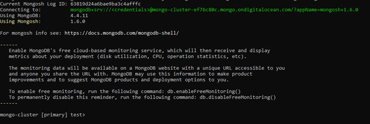
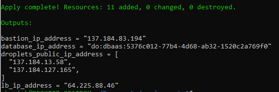

# 4640 Assignment 

Resources Created:
- VPC Network
- Bastion Server
- 2 Web Servers
- MongoDB Database
- Load Balancer

1) Download Terraform -> https://developer.hashicorp.com/terraform/downloads
2) Set up Digital Ocean and create a token to be able to create resources through Terraform
3) Add the token to the ```.env``` file and make sure to run the command ```source .env``` 
4) Create an SSH key pair to use as well in the configuration
5) Create a file called ```main.tf``` to store information about the provider which is digitalocean and this is where you should put your token
6) Create a file called ```data.tf``` to store your SSH key
7) Create a file called ```variables.tf``` to store your variables (e.g., do_token, region, droplet_count)
8) Create a file called ```terraform.tfvars``` to store changes to any pre-set variables from ```variables.tf```
8) Create a file called ```network.tf``` to declare your VPC resource
9) Create a file called ```bastion.tf``` to create your Bastion server, make sure to include the ```vpc_uuid``` parameter to put this inside VPC
10) Create a firewall around this server so that it can only be accessed via SSH
- Run this command to SSH into the servers:
  * ```ssh-add```
  * ```ssh -A root@<ip address>```

 </br>
* SSH from Bastion to Web1

 </br>
* SSH from Bastion to Web2

11) Create a file called ```database.tf``` to create a database cluster and firewall.
 </br>
This screenshot was taken with no firewall, that's how I had access to test it

12) Create a file called ```servers.tf``` to create the internal droplets, load balancer, and the firewall
13) Create a file called ```output.tf``` to create the output that you'd like to see at the end of the build (e.g., IP addresses)

 </br>
Successful ```terraform apply``` command

- Run ```terraform init``` to initialize your configuration where required files are loaded
- Run ```terraform fmt``` to format the files
- Run ```terrafrom validate``` to validate that the files have the correct syntax
- Run ```terraform plan``` to show the plan of what resources are going to be modified, created, and/or deleted
- Run ```terraform apply``` to confirm the plan
- Run ```terraform destroy``` to delete everything created through .tf files
