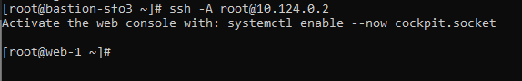
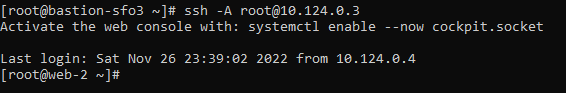

# 4640 Assignment 

Resources Created:
- VPC Network
- Bastion Server
- 2 Web Servers
- MongoDB Database
- Load Balancer

1) Download Terraform -> https://developer.hashicorp.com/terraform/downloads
2) Set up Digital Ocean and create a token to be able to create resources through Terraform
3) Create an SSH key pair to use as well in the configuration
4) Create a file called ```main.tf``` to store information about the provider which is digitalocean and this is where you should put your token
5) Create a file called ```data.tf``` to store your SSH key
6) Create a file called ```network.tf``` to declare your VPC resource
7) Create a file called ```bastion.tf``` to create your Bastion server, make sure to include the ```vpc_uuid``` parameter to put this inside VPC
8) Create a firewall around this server so that it can only be accessed via SSH

SSH from Bastion to Web1

SSH from Bastion to Web2
